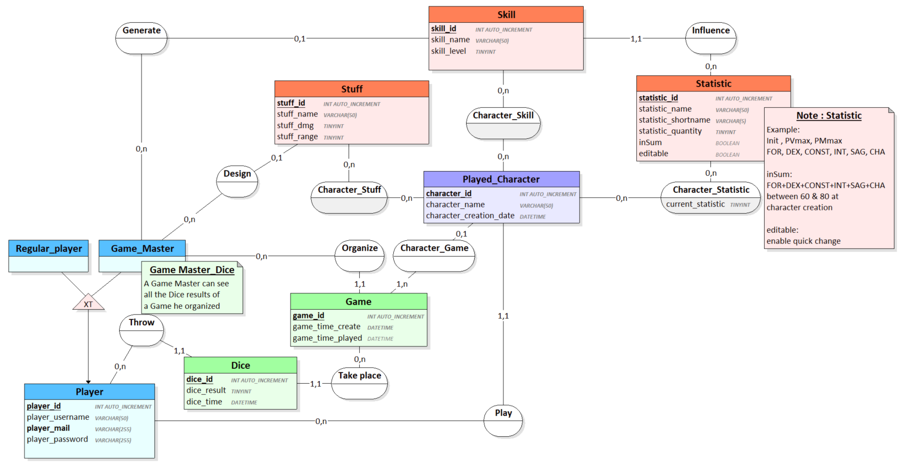
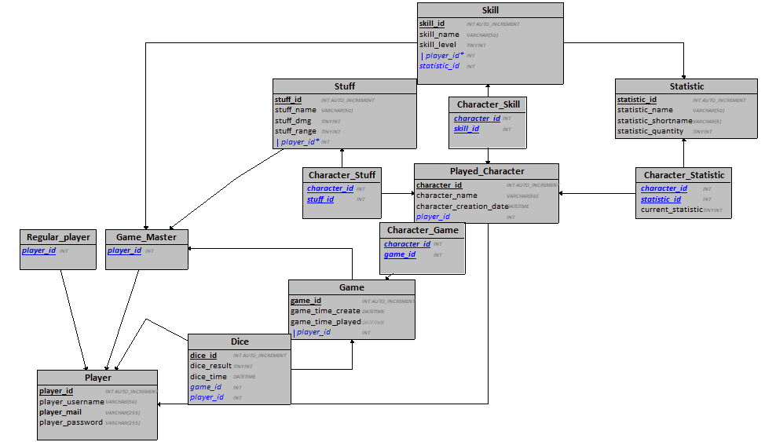

# PateFinder

Projet PHP - PateFinder

## How to use the project :

1. Start your server
2. Open PHPMyAdmin
3. Login in
4. Click on the "Import" button on the navbar

### You want to use the working database

1. Browse to import the database file named "workdatabase" in "Patefinder/ressources/.."
2. Import it

### You want to use an empty database

1. Browse to import the database file named "dump" in "Patefinder/ressources/.."
2. Import it
3. Execute the fixtures file "create_statistic.php" by using the URL "http://localhost/patefinder/ressources/fixtures/create_statistic.php".
   **If you are on MAC** execute this fixtures file "http://localhost:8888/patefinder/ressources/fixtures/create_statistic.php".

